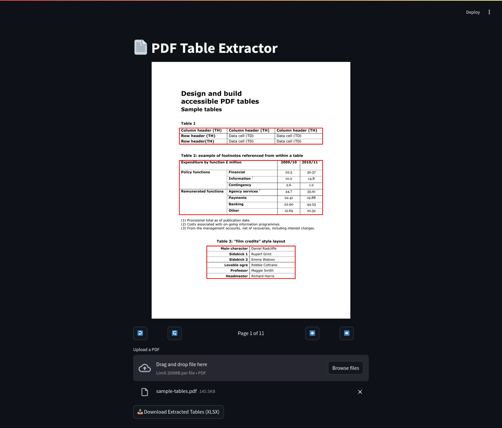

# PDF-Table-Extractor

Extract structured tables from PDF files and export them as downloadable CSV files — 
fully containerized with **FastAPI**, **Streamlit**, and **Docker**.

<div align="center">
  
</div>

---

## Prerequisites

Before you start, ensure the following tools are installed on your system:

- Docker  
- Docker Compose  

---

## Getting Started

### Start the Application

Run the following command to build and start the containers:  

```docker compose up -d```

This will: 

1. Build the Docker images for the Nginx, FastAPI and Streamlit services.  
2. Start the containers and serve the application.  

---

## Features

- Upload PDFs via Streamlit interface

- Preview and rotate pages with detected tables highlighted

- Automatically detect and merge tables that span across pages

- Extract nearest section headers to name Excel sheets

- Download a single `.xlsx` file with all tables, each as a sheet

---

## Access the Application

- **Streamlit Frontend**:  
  Visit <http://localhost:8080> to interact with the frontend.  

---

## Development Workflow

### Live Reloading

Both FastAPI and Streamlit support hot reloading out of the box. Any changes you 
make to the code will automatically reflect in the running containers.  

### Stopping the Application

To stop the application, run the following command:  

docker compose down  

This will stop and remove the containers, but the built images will remain.  

---

## Directory Structure

The project structure is as follows:  

```shell
.
├── backend/              # FastAPI app for conversion + table extraction
│   └── main.py
│   └── Dockerfile
│   └── requirements.txt
├── frontend/             # Streamlit app for uploading, previewing, downloading
│   └── app.py
│   └── Dockerfile
│   └── requirements.txt
├── nginx/                # Nginx reverse proxy
│   └── nginx.conf
│   └── Dockerfile
├── data/
│   ├── images/           # Page previews with overlays
│   ├── pdfs/             # Uploaded PDFs
│   └── exports/          # Final .xlsx files
├── docker-compose.yml
├── .gitignore
└── README.md
```

---

## Troubleshooting

- Ensure Docker and Docker Compose are installed and running on your system.  
- Verify that the required port (8080) are not in use by other 
applications.  

---

## License

This project is licensed under the MIT License. See the LICENSE file for details.
